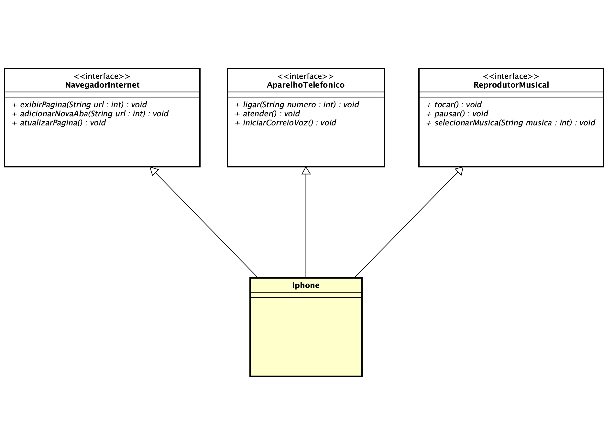

# DIO - Trilha Java Básico

Este repositório contém a solução para o desafio POO proposto pela [Digital Innovation One (DIO)](www.dio.me).

## Desafio de POO

O desafio consiste na modelagem e diagramação UML do iPhone, cobrindo seus papéis como Reprodutor Musical, Aparelho Telefônico e Navegador na Internet, baseando-se no vídeo de lançamento do iPhone de 2007.

### Comportamentos Implementados

- **Reprodutor Musical**
  - Tocar música
  - Pausar música
  - Selecionar música

- **Aparelho Telefônico**
  - Realizar ligação
  - Atender ligação
  - Iniciar correio de voz

- **Navegador na Internet**
  - Exibir página
  - Adicionar nova aba
  - Atualizar página

## Modelagem UML

Abaixo está o diagrama UML que representa as classes e interfaces propostas:

